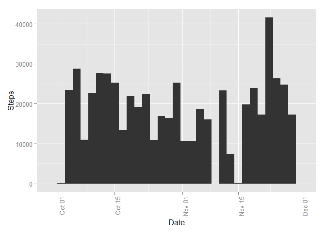
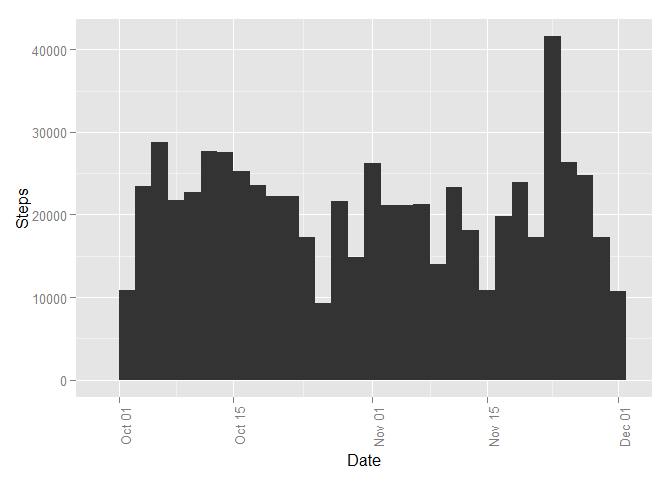

# Reproducible Research - Project Submission
mpekari  
Sunday, Oct 18, 2015  

This document is the project submission for Coursera.org Reproducible Research course.

### Loading and preprocessing the data

First we load the dataset, convert date column to Date, and remove NA's.

```r
data <- read.csv("activity.csv")
data$date <- as.Date(data$date, "%Y-%m-%d")
data.clean <- na.omit(data)
```

### Total number of steps taken per day

Histogram for total number of steps per day.

```r
day.sum <- aggregate(steps ~ date, data = data.clean, FUN = sum)
library(ggplot2)
qplot(day.sum$date, weight=day.sum$steps, xlab="Date", ylab="Steps") + theme(axis.text.x = element_text(angle = 90, hjust = 1))
```

 

Mean of total number of steps per day.

```r
mean(day.sum$steps)
```

```
## [1] 10766.19
```

Median of total number of steps per day.

```r
median(day.sum$steps)
```

```
## [1] 10765
```

### Average daily activity pattern

Time series plot for average number of steps taken, averaged across all days.

```r
interval.mean <- aggregate(steps ~ interval, data = data.clean, FUN = mean)
ggplot(interval.mean, aes(x=interval, y=steps)) + geom_line()
```

 

Interval with highest number of average steps.

```r
interval.mean[which.max(interval.mean[,2]),1]
```

```
## [1] 835
```

Total number of missing values.

```r
nrow(data[is.na(data$steps), ])
```

```
## [1] 2304
```

### Imputing missing values

The missing values are imputed with average number of steps within the given interval, averaged across all days.  

```r
data.imp <- data
for (i in 1:nrow(data.imp)) {
    if (is.na(data.imp[i,1])) {
        data.imp[i,1] <- interval.mean[match(data.imp[i,3], interval.mean[,1]),2]
    }
}
head(data.imp)
```

```
##       steps       date interval
## 1 1.7169811 2012-10-01        0
## 2 0.3396226 2012-10-01        5
## 3 0.1320755 2012-10-01       10
## 4 0.1509434 2012-10-01       15
## 5 0.0754717 2012-10-01       20
## 6 2.0943396 2012-10-01       25
```

Histogram with imputed values.

```r
day.sum.imp <- aggregate(steps ~ date, data = data.imp, FUN = sum)
qplot(day.sum.imp$date, weight=day.sum.imp$steps, xlab="Date", ylab="Steps") + theme(axis.text.x = element_text(angle = 90, hjust = 1))
```

```
## stat_bin: binwidth defaulted to range/30. Use 'binwidth = x' to adjust this.
```

 

Comparing means with original and imputed datasets.

```r
average <- mean(day.sum$steps)
average.imp <- mean(day.sum.imp$steps)
c(average, average.imp)
```

```
## [1] 10766.19 10766.19
```
The means are exactly the same. 

Comparing medians with original and imputed datasets.

```r
median <- median(day.sum$steps)
median.imp <- median(day.sum.imp$steps)
c(median, median.imp)
```

```
## [1] 10765.00 10766.19
```
The imputed dataset has higher median. 


### Differences in activity patterns between weekdays and weekends

Creating a new column for day type (weekday or weekend).

```r
data.imp$day.type <- "weekday"
data.imp[weekdays(data.imp$date) %in% c("Saturday", "Sunday"),4] <- "weekend"
data.imp$day.type <- as.factor(data.imp$day.type)
```

Time series plot for average steps per interval, averaged across all days, using the imputed dataset.

```r
interval.mean.daytype <- aggregate(steps ~ interval + day.type, data = data.imp, FUN = mean)
ggplot(interval.mean.daytype, aes(x=interval, y=steps)) + geom_line() + facet_grid(day.type~.)
```

 
